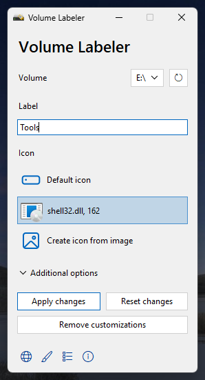
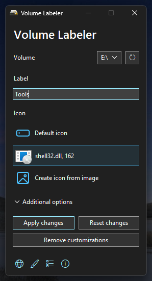

<div align="center">
    
</div>

# Volume Labeler
[](https://github.com/Valer100/Volume-Labeler/releases/latest)
[](https://github.com/Valer100/Volume-Labeler/releases)
[]()
[]()
[](https://github.com/Valer100/Volume-Labeler/releases)
[](https://github.com/Valer100/Volume-Labeler/stargazers)
[](https://github.com/Valer100/Volume-Labeler/graphs/contributors)
[](https://github.com/Valer100/Volume-Labeler/commits/main)
[](https://github.com/Valer100/Volume-Labeler/commits/main)
[](https://github.com/Valer100/Volume-Labeler/blob/main/LICENSE)

A simple tool for changing the label and the icon of a volume in Windows. It makes these changes by creating an `autorun.inf` file (or edits the existing one) on the volume you want to change its label and icon. 

When selecting a volume, it checks if `autorun.inf` is present on it and then retrieves its actual label and icon for not typing the same label if you want to only change the volume's icon or selecting the same icon if you only want to change the volume's label.

It also has options to hide the `autorun.inf` file and the `vl_icon` folder (the icon is stored in that folder).

If you want to get rid of all customizations (including the ones not made by Volume Labeler), you can use the "Remove customizations" option.

## 📷 Screenshots

| Light Mode | Dark Mode |
|:----------:|:---------:|
|  |  |

## ▶️ Running from source
Before running from the source, you must install the dependencies. To do that, open Command Prompt in the folder of the cloned repository and run the following command:

```
pip install -r requirements.txt
```

After that, open the `main.pyw` file.

## 🏗️ Building

### Building the app
Just run `build_app.bat`. It will do everything needed to build the app. After the build process is done, you can find the built app in a `build` folder (or in a `dist` folder if the renaming process fails).

### Building the installer
Before building the installer, you must install Inno Setup Compiler on your computer. You can download it [here](https://jrsoftware.org/isdl.php/).

Also, you must build the app first before building the installer. After building the app, make sure a `build` folder appears. If it doesn't and appears a `dist` folder intstead, rename that folder to `build`. After that, right-click `build_installer.iss` and choose `Compile`. After the installer was built, you can find it in the same `build` folder.

## 💿 Download
Click [here](https://github.com/Valer100/Volume-Labeler/releases/latest) to download the latest version. You can download either the portable or the installer version.

> [!WARNING]
> At the moment, the binaries from Releases tab were built only for 64 bit Windows. They will not work on 32 bit Windows.

## 📜 License
[MIT](https://github.com/Valer100/Volume-Labeler/blob/main/LICENSE)
